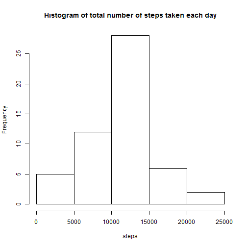
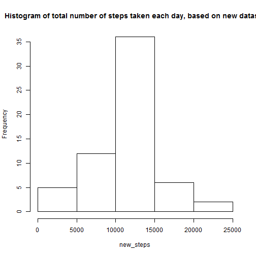

## Introduction 

It is now possible to collect a large amount of data about personal movement using activity monitoring devices such as a Fitbit, Nike Fuelband, or Jawbone Up. These type of devices are part of the "quantified self" movement - a group of enthusiasts who take measurements about themselves regularly to improve their health, to find patterns in their behavior, or because they are tech geeks. But these data remain under-utilized both because the raw data are hard to obtain and there is a lack of statistical methods and software for processing and interpreting the data.

This assignment makes use of data from a personal activity monitoring device. This device collects data at 5 minute intervals through out the day. The data consists of two months of data from an anonymous individual collected during the months of October and November, 2012 and include the number of steps taken in 5 minute intervals each day.

In this project, we use this data to make some analyses as seen below.

## Data loading

Firstly, we load the data, get an idea of it and make transformations to it for data analysis.


```r
activity <- read.csv("activity.csv",colClasses = c("numeric", "character","integer"))
str(activity)
```

```
## 'data.frame':	17568 obs. of  3 variables:
##  $ steps   : num  NA NA NA NA NA NA NA NA NA NA ...
##  $ date    : chr  "2012-10-01" "2012-10-01" "2012-10-01" "2012-10-01" ...
##  $ interval: int  0 5 10 15 20 25 30 35 40 45 ...
```

```r
names(activity)
```

```
## [1] "steps"    "date"     "interval"
```

```r
library(lubridate)
activity$date <- ymd(activity$date)
```

##Calculating total number of steps taken per day

```r
library(dplyr)
```

```
## 
## Attaching package: 'dplyr'
```

```
## The following objects are masked from 'package:lubridate':
## 
##     intersect, setdiff, union
```

```
## The following objects are masked from 'package:stats':
## 
##     filter, lag
```

```
## The following objects are masked from 'package:base':
## 
##     intersect, setdiff, setequal, union
```

```r
steps1 <- activity %>%
  filter(!is.na(steps)) %>%
  group_by(date) %>%
  summarize(steps = sum(steps)) %>%
  print
```

```
## Source: local data frame [53 x 2]
## 
##          date steps
##        (time) (dbl)
## 1  2012-10-02   126
## 2  2012-10-03 11352
## 3  2012-10-04 12116
## 4  2012-10-05 13294
## 5  2012-10-06 15420
## 6  2012-10-07 11015
## 7  2012-10-09 12811
## 8  2012-10-10  9900
## 9  2012-10-11 10304
## 10 2012-10-12 17382
## ..        ...   ...
```

##Histogram, mean and median of the total number of steps taken per day

```r
library(ggplot2)
steps <- steps1$steps
hist(steps, main = "Histogram of total number of steps taken each day")
```



```r
mean(steps)
```

```
## [1] 10766.19
```

```r
median(steps)
```

```
## [1] 10765
```

##Calculating average number of steps in each 5-minute interval, over all days

```r
daily <- activity %>%
        filter(!is.na(steps)) %>%
        group_by(interval) %>%
        summarize(steps=mean(steps)) %>%
        print
```

```
## Source: local data frame [288 x 2]
## 
##    interval     steps
##       (int)     (dbl)
## 1         0 1.7169811
## 2         5 0.3396226
## 3        10 0.1320755
## 4        15 0.1509434
## 5        20 0.0754717
## 6        25 2.0943396
## 7        30 0.5283019
## 8        35 0.8679245
## 9        40 0.0000000
## 10       45 1.4716981
## ..      ...       ...
```

##Time series plot of the average number of steps in each 5-minute interval, over all days

```r
plot(daily, type = "l")
```


##Computing the interval with maximum number of steps, averaged over all days.

```r
daily[which.max(daily$steps), ]$interval
```

```
## [1] 835
```

##Reporting the total number of missing values in the dataset

```r
missing <- sum(is.na(activity))
missing
```

```
## [1] 2304
```
##Creating new dataset by filling in missing values with the mean number of steps for that day

```r
missing <- sum(is.na(activity))
missing
```

```
## [1] 2304
```

##Computing mean and median of the total number of steps taken per day

```r
new <- activity %>%
        group_by(interval) %>%
        mutate(steps = ifelse(is.na(steps), mean(steps, na.rm=TRUE), steps))
summary(new)
```

```
##      steps             date               interval     
##  Min.   :  0.00   Min.   :2012-10-01   Min.   :   0.0  
##  1st Qu.:  0.00   1st Qu.:2012-10-16   1st Qu.: 588.8  
##  Median :  0.00   Median :2012-10-31   Median :1177.5  
##  Mean   : 37.38   Mean   :2012-10-31   Mean   :1177.5  
##  3rd Qu.: 27.00   3rd Qu.:2012-11-15   3rd Qu.:1766.2  
##  Max.   :806.00   Max.   :2012-11-30   Max.   :2355.0
```

##Histogram of the total number of steps taken each day, based on the new dataset 

```r
new.steps <- new %>%
  group_by(date) %>%
  summarize(steps = sum(steps)) 
new_steps <- new.steps$steps
hist(new_steps, main = "Histogram of total number of steps taken each day, based on new dataset")
```



```r
mean(new_steps)
```

```
## [1] 10766.19
```

```r
median(new_steps)
```

```
## [1] 10766.19
```

## Comparing if there is a change in the mean, median values in the old and new datasets.

```r
mean(steps) == mean(new_steps)
```

```
## [1] TRUE
```

```r
median(steps) == median(new_steps)
```

```
## [1] FALSE
```

##Results of comparisom
Turns out that only the median has shifted.

##Creating a new factor variable in the dataset, to distinguish between a "weekday" and a "weekend".

```r
dayofweek <- function(date) {
    if (weekdays(as.Date(date)) %in% c("Saturday", "Sunday")) {
        "weekend"
    } else {
        "weekday"
    }
}
new$daytype <- as.factor(sapply(new$date, dayofweek))
```

##Comparing time plots to find difference in patterns between weekdays and weekends

```r
par(mfrow = c(2, 1))
for (type in c("weekend", "weekday")) {
    steps.type <- aggregate(steps ~ interval, data = new, subset = new$daytype == 
        type, FUN = mean)
    plot(steps.type, type = "l", main = type)
}
```


